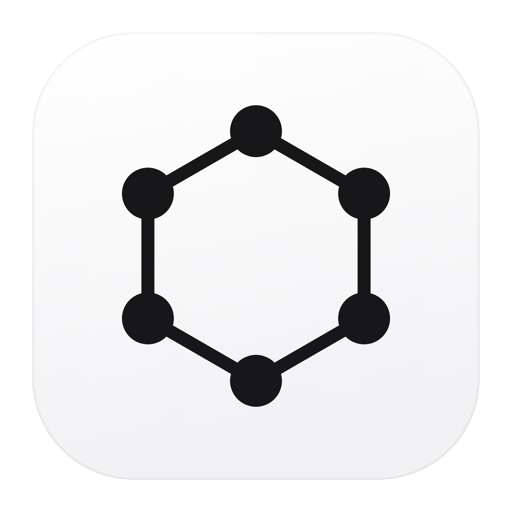

<p align="center">
  
</p>

<h1 align="center">Graphite</h1>

A local-only, Notion-style workspace for the desktop. Nested pages, a block
editor, and full-text search — all stored in a single SQLite file on your
machine. No account, no sync, no network calls.

## Getting started

```bash
npm install
```

```bash
npm run dev
```

Other scripts:

```bash
npm run typecheck
```

```bash
npm run build
```

```bash
npm run dist:mac
```

`dist:win` and `dist:linux` are also available. Packaging is unsigned by
default — set a signing identity in `electron-builder.yml` before distributing.

## Features

- **Tabs** — open several pages at once, each with its own back/forward
  history. Drag to reorder, ⌘-click or middle-click a page to open it in a new
  tab, middle-click a tab to close it. The strip is restored on next launch.
- **Nested pages** — unlimited depth, drag to reorder or re-parent in the
  sidebar. Dropping a page onto another nests it; dropping near a row's top or
  bottom edge places it above or below.
- **Block editor** — headings, bulleted/numbered/to-do lists, quotes, dividers,
  and syntax-highlighted code blocks. Press `/` on an empty line for the block
  menu; select text for the formatting bar.
- **Draggable blocks** — hover any block for controls in the left gutter: the
  grip reorders it (click to select, drag to move), and `+` inserts a block
  below. List and to-do items get their own handle so they move individually.
- **Multi-block selection** — drag from the left gutter or the space below the
  content to lasso whole blocks; the selection acts as one for delete, copy,
  and paste.
- **Full-text search** — `Cmd/Ctrl + K`, backed by SQLite FTS5 with prefix
  matching and result snippets.
- **Favorites**, per-page emoji icons, and breadcrumb navigation.
- **Autosave** — writes ~600 ms after you stop typing, and flushes on close.
- **Light / dark / system** theme.

## Keyboard shortcuts

| Shortcut               | Action         |
| ---------------------- | -------------- |
| `Cmd/Ctrl + K`         | Search pages   |
| `Cmd/Ctrl + N`         | New page       |
| `Cmd/Ctrl + Shift + N` | New subpage    |
| `Cmd/Ctrl + T`         | New tab        |
| `Cmd/Ctrl + W`         | Close tab      |
| `Ctrl + Tab`           | Next tab       |
| `Ctrl + Shift + Tab`   | Previous tab   |
| `Cmd/Ctrl + [` / `]`   | Back / forward |
| `Cmd/Ctrl + B`         | Toggle sidebar |
| `Cmd/Ctrl + Shift + L` | Toggle theme   |
| `Cmd/Ctrl + ,`         | Settings       |

## Where your data lives

One SQLite file in Electron's per-user data directory:

- macOS — `~/Library/Application Support/graphite/graphite.db`
- Windows — `%APPDATA%\graphite\graphite.db`
- Linux — `~/.config/graphite/graphite.db`

Settings → **Reveal** opens it in your file manager. Back it up by copying that
file (take `-wal` and `-shm` alongside it if present, or close the app first).
